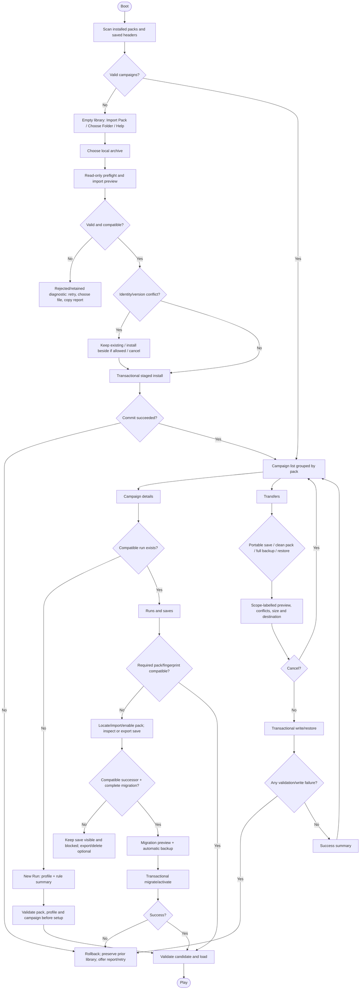

# Campaign Library UX Research

Planning ownership and sequencing remain in the
[Project Control Plane](../plans/project_control_plane_2026-06-29.md).

## Scope and method

This report prepares a design discussion; it does not define shipped behavior. External
observations, Project Prometheus recommendations, and owner decisions are deliberately
separate. Primary sources were accessed 2026-07-23. No competitor artwork is reproduced.

Approved constraints are: zero-content boot; self-contained, script-free packs; user state
stored outside clean installed packs but namespaced by package and campaign identity; portable
saves, clean-pack exports, and full backups are distinct artifacts; migration is declarative,
validated, and transactional.

## Comparable systems

### Evidence matrix

| System | Relevant observed behavior | Strength | Failure / mismatch | Prometheus question informed |
|---|---|---|---|---|
| Foundry VTT worlds/packages | Setup lists worlds by recent launch; a fresh install has no worlds; compatibility-risk badges appear before launch; Safe Configuration disables modules/scenes; deletion requires typing the world title. Package backups and whole-install snapshots are separate, and migration offers a pre-migration backup. [Worlds](https://foundryvtt.com/article/game-worlds/), [backups](https://foundryvtt.com/article/backups/) | Separates playable state (world), required system/module content, recovery, and destructive safeguards. | Its worlds may contain executable modules and server administration concepts; Prometheus packs cannot execute code and should not expose this complexity. | CL-MODEL-01, CL-LIFE-06, CL-RECOVERY-04, CL-SAFETY-03 |
| Vortex | Installed mods, downloads, plugins, saves, and independent profiles are separate views; conflicts and cyclic ordering rules get explicit resolution/detail surfaces. [Project/feature overview](https://github.com/Nexus-Mods/Vortex), [cyclic rules and profiles](https://github.com/Nexus-Mods/Vortex/wiki/MODDINGWIKI-Users-FAQ), [file conflicts](https://github.com/Nexus-Mods/Vortex/wiki/MODDINGWIKI-Users-General-Managing-File-Conflicts) | Makes state and conflicts inspectable without forcing every detail into the launch list. | Prometheus v1 forbids dependencies, load order, file overrides, and profile stacks. Showing those controls would promise unsupported composition. | CL-MODEL-04, CL-LIFE-05, CL-ADV-03 |
| RetroArch playlists | Local content may live anywhere; scanners create JSON playlists, loose scanning can retain playable but unmatched content, metadata/thumbnails are optional, and a core can be selected per playlist. [Playlists and thumbnails](https://docs.libretro.com/guides/roms-playlists-thumbnails/) | Offline-first discovery tolerates missing metadata and keeps path/content identity distinct from display labels. | Loose launch is unsafe for Prometheus: a pack must fully validate before activation, and title matching must never replace durable ids/fingerprints. | CL-FIRST-02, CL-MISSING-01, CL-NAV-04 |
| Foundry backup manager | Package backups, global snapshots, and manual asset backups are named as different scopes; restore is managed rather than direct file editing; backup metadata shows size and compatibility risks. [Backups](https://foundryvtt.com/article/backups/) | Clearly separates single-content recovery from whole-library recovery and warns that scope matters. | Foundry snapshots may omit assets outside managed folders. Prometheus full backup must preview exact included components and validate all selected bytes. | CL-TRANSFER-01 through CL-TRANSFER-06 |
| Penpot import/export | Import previews items and failures before commit; exported `.penpot` is ZIP plus inspectable JSON/assets; files can be exported from hosted or self-hosted instances. [Import/export](https://help.penpot.app/user-guide/export-import/export-import-files/), [format](https://help.penpot.app/user-guide/export-import/penpot-file-format/) | Preview-before-write and open, inspectable artifacts support trust and rollback. | It is a design-file workflow, not a game library; Prometheus needs identity, compatibility, and save-impact checks beyond file validity. | CL-LIFE-01, CL-TRANSFER-03, CL-SAFETY-01 |

### Comparative conclusions (inferences, not decisions)

1. The top-level player object should be a **campaign**, grouped beneath its installed pack;
   the mutable **run** belongs beneath a campaign. This matches what players launch while
   retaining the pack identity needed for repair and management.
2. Launch and management should share one library but use progressive disclosure: campaign
   rows and a details pane for ordinary use; install/version/diagnostics in Manage actions.
3. Invalid, missing, or disabled content should remain visible as a non-launchable record with
   repair actions. Silently dropping it destroys the path from a save to recovery.
4. Import and restore need an inspect/preview phase followed by one transactional commit.
5. The UI should never introduce dependency/load-order language while v1 packs are closed and
   self-contained. “Required content missing” means the selected pack itself is incomplete.

## Tool evaluation

| Tool | Licence/cost | Offline/export and Git durability | Accessibility / burden | Verdict |
|---|---|---|---|---|
| Mermaid in Markdown | MIT/free | Text lives directly in Git; SVG render is optional | `accTitle`/`accDescr` are supported; diffs review well. Complex spatial layouts are weaker. [Swimlanes](https://mermaid.js.org/syntax/swimlanes) | Primary wireflow/state diagram tool. |
| diagrams.net desktop | Apache-2.0/free | Offline desktop; local editable XML and SVG/PDF export | Easy visual editing, but XML diffs are noisy and accessibility metadata needs discipline. [Official overview](https://www.drawio.com/) | Fallback for diagrams Mermaid cannot express clearly. |
| Penpot | MPL-2.0/free community edition | Self-hostable; `.penpot` exports are ZIP+JSON; SVG/PDF/PNG export; interactive board links | Strong clickable prototypes and inspectable exports; running a shared instance adds collaboration burden. [Self-hosting](https://help.penpot.app/user-guide/first-steps/cloud-selfhost/), [prototyping](https://help.penpot.app/user-guide/prototyping-testing/prototyping/) | Primary clickable prototype after paper/Markdown flow stabilizes. |
| Markdown tables + tracker | Repository-native | Plain text/JSON, reviewable and offline | Best stable-id decision history; not interactive | Primary question and decision tracking. |
| Godot throwaway prototype branch | MIT engine; project-local | Exact target controls/input map; scenes are Git assets | Highest fidelity for focus/text scaling/controller, but risks accidental production coupling | Later validation only, on a dedicated `agent/**` branch; never the first wireframe. |
| Existing script tests | Project-native | Headless, already in Git/CI | Good semantic/focus assertions; limited rendered-layout evidence | Primary fixture/state regression base. |
| GUT / GdUnit4 | MIT/free | Godot 4 CLI/JUnit; GdUnit4 adds scene runner input simulation. [GUT](https://github.com/bitwes/Gut), [GdUnit4](https://github.com/godot-gdunit-labs/gdUnit4) | New dependency and migration burden; existing harness already works | Fallback only if the current harness cannot express interaction sequences. |
| Structured usability script (Markdown) + CSV/JSON observations | Open text formats/free | Fully offline and Git-reviewable | Low setup; requires disciplined session IDs and no personal data | Primary moderated test capture; screen recording is optional evidence, not the decision record. |

Recommended toolkit: Mermaid + Markdown for wireflows/state; diagrams.net fallback;
Markdown stable-id tables plus `coordination/tasks.json` for decisions; Penpot for a later
clickable prototype; current Godot harness plus a disposable Godot prototype branch for
controller/focus validation. Use contrast calculations and 200% text/layout fixtures as explicit
test cases rather than trusting a design tool’s checker.

## Current-state interaction audit

Exact anchors below describe the branch at `443580572410`.

| State/action | Current entry and display | Input/focus and exit | Persistence / error / gap |
|---|---|---|---|
| Main Menu | `scripts/ui/MainMenu.gd:22-41`; Continue, Load, New Game, Settings, Quit. Continue/Load are disabled from save availability. | Continue gets focus when usable, otherwise New Game; cancel handling is in `_unhandled_input` (`:227`). | Load errors are modal (`:89-178`). No zero-pack-specific primary CTA yet. |
| New Game | `scripts/ui/NewGameScreen.gd:34-137,249-438`; shipped and validated installed campaigns are flattened into one option list; Manage Campaigns opens library. | Explicit focus setup and back-to-origin focus. Keyboard/controller focus tracing exists at `:490-559`. | Activates exact Tier-2 source before start (`test_new_game_campaign_pack_selection.gd`). No pack-grouped details, profile comparison, or no-content contract yet. |
| Campaign Library | `scripts/ui/CampaignLibraryScreen.gd:25-105`; installed-package option plus Import, Export, Back. | Import receives default focus. FileDialog drives import/export; result modal focuses OK. Mouse/keyboard/controller around native FileDialog still needs Windows evidence. | Import preflights then installs; duplicate version rejects; export revalidates. No preview, enable/disable, remove, versions, campaign children, progress, cancel, or retained-invalid rows. |
| Load Game | `scripts/ui/LoadGameScreen.gd:54-301`; flat slot rows with Load/Delete/Export plus Import. Labels include kind/time/campaign state. | First loadable row or Import receives focus; delete confirmation explicitly restores focus. | Portable import supports integrity/tamper acknowledgement. No grouping by pack/campaign/run, missing-pack disabled row, migration preview, rename/archive/duplicate, or backup surface. |
| Pack discovery | `CampaignPackRegistry.gd` scans installed identity/version paths and returns validated summaries. | No direct UI state beyond library refresh. | Invalid/unreadable candidates are not represented as actionable retained rows. |
| Pack install | `CampaignArchivePreflight.gd` validates hostile ZIP limits/paths/types; `CampaignPackInstaller.gd` stages, revalidates, and atomically promotes. Tests cover duplicates, second-pass mutation, injected failures, cleanup, and unsafe identity. | Synchronous FileDialog-to-result flow; no preview/progress/cancel. | Transaction semantics are strong. Replacement, rollback-to-older, quarantine, and disable are absent by design. |
| Clean-pack export | `CampaignPackExporter.gd`; library exports the selected installed package. Tests prove deterministic bytes, admitted paths, revalidation, and reinstall round trip. | Synchronous FileDialog; result modal. | Correct clean scope; no summary of exclusions or overwrite preview. |
| Save persistence/portable transfer | `SaveManager.gd:86-306,526-609`; transactional slots/index, portable JSON inspect/import/export, tamper warning, delete. | Load screen owns UI. | Flat namespace and current validation require available definitions. Planned source/fingerprint/migration grouping is not implemented. |
| Migration and full backup | Planned in `pack_associated_save_implementation_plan_2026-07-23.md`; no current player surface. | None. | Missing pack, disabled pack, compatible successor, fingerprint mismatch, chain gaps, selective restore, full rollback, and disk-space preview are design states, not shipped states. |
| Activation failure | New Game activation returns false and logs errors; Tier-2 adapter/validators reject missing families/references before use. | No comprehensive recovery action set. | Needs plain-language category, details export/copy, Locate/Import/Enable paths, and return focus. |

Godot requires explicit initial focus and recommends explicit focus neighbors for complex UI;
automatic guessing can be unintended. This supports a controller completion test for every state,
not merely focusable controls. [Godot focus guidance](https://docs.godotengine.org/en/4.5/tutorials/ui/gui_navigation.html)

## Proposed information architecture

```text
Campaign Library
├── Campaigns (launch-first default)
│   └── Pack group
│       └── Campaign row → Details
│           ├── Continue / New Run
│           ├── Runs and saves
│           └── Compatibility / repair status
├── Manage Content
│   ├── Import preview → transactional install
│   ├── Installed pack versions / disable / remove
│   └── Invalid or quarantined candidates / diagnostics
├── Transfers
│   ├── Import/export portable save
│   ├── Export clean pack
│   └── Create/restore full backup
└── Settings/help
    ├── Scan folders / rescan
    └── terminology, formats, diagnostics privacy
```

The campaign is the launch target; the pack is the content-management boundary; the run is the
player-progress boundary; the save is a recovery point inside a run. A global Load shortcut may
remain, but it should deep-link to the same grouped run/save model rather than own a second model.

## End-to-end wireflow



Input contract for every node: mouse activation, keyboard Tab/arrows plus Enter/Escape, and
controller D-pad/stick plus Confirm/Cancel must reach the same actions. Opening a child state
focuses its heading or primary safe action; closing returns focus to the invoking row/action.
Destructive actions never receive default focus. Long operations expose progress and may cancel
only before the atomic promotion begins; after commit begins, the UI says “Finishing…” and waits
for success or rollback.

## Provisional recommendations (not decisions)

1. Default to a list + details pane, grouped Pack → Campaign, with Runs inside campaign details.
2. Keep Campaign Library as launcher and manager, but put lifecycle/diagnostics behind Manage.
3. Make import preview mandatory; never mutate during scan or preview.
4. Keep unavailable campaigns and saves visible with status text and relevant repair actions.
5. Use text + icon + status heading; color is redundant only.
6. Separate Portable Save, Clean Pack, and Full Backup in names, extensions, locations, and
   confirmation copy.
7. Require an automatic pre-migration backup and all-or-nothing migration/restore by default.
8. Preserve a global Load shortcut as a filtered deep link, not a second save hierarchy.
9. Keep technical details collapsed but copy/exportable with paths redacted to safe logical ids.
10. Do not add catalogue browsing, dependencies, signatures, cloud sync, or quarantine storage to
    v1 without separate scope and threat-model decisions.

## Later validation fixtures

Generate deterministic fixtures for: empty library; one/many packs and campaigns; same title with
different ids; same id old/new/same version; invalid ZIP; missing family/reference; disabled pack;
missing path; changed fingerprint; no/partial/complete migration chain; corrupt save; 1/100/1000
runs; long/localized/RTL-like labels; absent thumbnails; read-only destination; insufficient space;
injected failure before and during promotion. Assertions should cover focus owner, complete
controller route, cancel return, stable status category, unchanged bytes/state after failure, and
200% text without clipped actions. Real Windows visual/controller evidence remains required.
