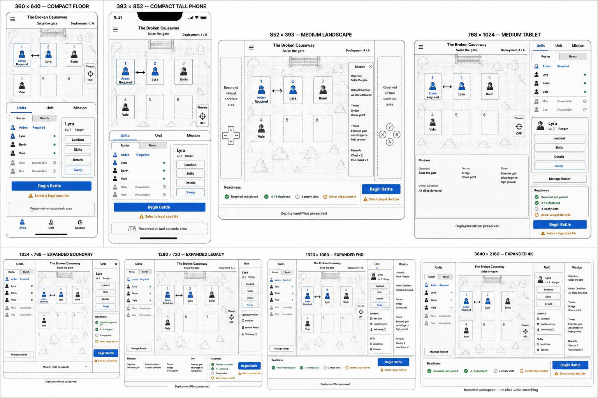

# Responsive Prep and Map Deployment — Comparative Research

## Purpose

This packet researches the player-facing seam between the responsive UI programme and
`B4-PREP-MAP-DEPLOYMENT`. It deliberately designs the final responsive preparation
experience rather than building the older desktop-first transitional `PrepScreen` described
in the 2026-07-14 handoff.

The engine seam is not the open question: `DeploymentPlan` already owns the committed
`unit_id -> authored start_tile` mapping. The open work is how players author, inspect and
validate that same plan across eight target viewports and keyboard, controller and touch.

## Comparative findings

### The durable series pattern

Fire Emblem preparation screens consistently separate a small set of jobs: select the
deployed roster up to a map cap, preserve mandatory units, inspect the battlefield, swap
deployed units among fixed starting tiles, manage equipment, save, and start battle. This
is useful because it separates **who deploys** from **where they deploy** while keeping both
inside one pre-battle context.

Source: [Battle Preparation overview](https://fireemblem.fandom.com/wiki/Battle_Preparation).

### Three Houses: powerful, but deep

Three Houses exposes Inventory, abilities, combat arts, battalions, reclassing and map
inspection from battle preparation. Its map view also supports starting-position changes,
enemy inspection, movement/attack ranges and terrain or chest scouting. The strength is
that strategic information and army configuration are reachable before commitment.

The cost is fragmentation: each concern becomes another preparation submenu. Player reports
specifically describe preparation as time-consuming and ask for combined configuration or
saved unit configurations. Prometheus should preserve access to deep configuration without
making every subsystem a parallel top-level destination.

Sources:

- [Three Houses preparation screen](https://www.supercheats.com/fire-emblem-three-houses/walkthrough/battle-preparation-screen)
- [Three Houses map and inventory behavior](https://gamewith.net/fire-emblem-three-houses/article/show/10355)
- [Player discussion of preparation burden](https://www.reddit.com/r/fireemblem/comments/otmzve/battle_preparations_is_the_worst_part_of_this_game/)

### Engage: optimize the common case

The useful Engage lesson is the player rhythm rather than a unique screen primitive: players
commonly retain a stable core team and make a small number of substitutions. The preparation
surface should therefore make the existing plan obvious and make one-for-one substitution
cheap; it should not require rebuilding deployment on every visit.

Source: [Engage player discussion of reducing preparation overhead](https://www.reddit.com/r/fireemblem/comments/1dywe0w/how_do_i_avoid_spending_to_much_time_in_the/).

### Fates and Awakening: direct map placement remains legible

Fates preserves the established pattern of opening View Map and directly swapping units on
starting positions; Awakening likewise presents Select Units and View Map as the essential
pre-battle pair. This supports a shared live plan rather than two copies of selection state.

Sources:

- [Fates map-position guidance](https://www.gamesradar.com/fire-emblem-fates-tips/)
- [Awakening battle preparations](https://www.gamerguides.com/fire-emblem-awakening/guide/intro-and-gameplay/gameplay/battle-preparations)

### Three Hopes: roles and direct map assignment

Three Hopes distinguishes primary and secondary deployed roles and makes map assignment
direct. Prometheus does not need those closed role names, but the broader lesson applies:
when deployment semantics differ, encode them visibly on the unit and tile rather than
hiding them in a separate explanatory menu. Any future role vocabulary must remain an open
registry under the project architecture rule.

Source: [Three Hopes deployment and map orders](https://www.gamerguides.com/fire-emblem-warriors-three-hopes/guide/gameplay/tips-and-tricks/how-to-issue-orders-in-three-hopes).

## Recommended Prometheus interaction model

1. **Map-first command centre.** The battlefield stays visible during routine selection,
   swapping and inspection. Mission objective, defeat condition, terrain, threats and
   optional rewards are adjacent or one drawer away.
2. **One live `DeploymentPlan`.** Manage Roster owns **who**; Map Preview owns **where**.
   Both edit the same state, and size-class or input changes never discard it.
3. **Cheap substitution.** Selecting an occupied tile and a roster/bench unit offers a
   direct substitution. Swapping two occupied starting tiles is a first-class action.
4. **Contextual configuration.** Loadout, skills and details live on the selected-unit card.
   `Manage Roster` remains the route to deep army configuration; it does not become six
   equally weighted prep-menu entries.
5. **Persistent readiness.** Required-unit placement, deployed count, empty capacity and
   every unmet condition remain visible. `Begin Battle` remains reachable and explains why
   it cannot commit.
6. **Responsive composition, not separate products.** Compact uses map plus pageable bottom
   sheets; Medium uses map plus drawer/two-pane; Expanded uses roster/map/details together.
   The action vocabulary and plan state are identical.
7. **Bounded high-resolution layout.** FHD and 4K add map and useful detail space without
   enlarging tokens or stretching sidebars across the display.

## Target viewports

The proof set covers the six ratified UI viewports plus explicit FHD and 4K validation:

| Logical viewport | Composition |
|---|---|
| 360×640 | Compact floor; map plus `Units` / `Unit` / `Mission` bottom sheet |
| 393×852 | Compact tall phone; 55% map and larger half-height sheet |
| 852×393 | Medium landscape; centred 4:3 map and reserved controller side columns |
| 768×1024 | Medium tablet; map plus persistent switchable drawer |
| 1024×768 | Expanded boundary; three-pane command centre |
| 1280×720 | Expanded legacy; wider map and contextual loadout preview |
| 1920×1080 | Expanded FHD; bounded workspace with complete readiness and mission panes |
| 3840×2160 | Expanded 4K; centred maximum-width workspace, no ultra-wide stretching |

## Known implementation constraints carried forward

- `CampaignNode.required_units`, `excluded_units` and `deployment_cap` are already authored
  and validated; prep is their consumer, not a reason to change their schema.
- `MapData.player_start_tiles` remains the placement surface.
- Campaign Retry returns through prep with the restored map-start party and previous plan;
  bare single-map Retry remains unchanged.
- Suspend-resume cannot silently accept a plan that the suspend spawn path ignores.
- A dead required unit under permadeath needs an explicit authored/player-facing outcome.
- The plan is launch state, not between-map campaign-save state.
- Panels and activities remain open registries, not a closed enum or `match` statement.

## What the wireframes do not decide

The mockups are hypotheses for discussion, not accepted UI contracts. The open decisions are
recorded in `responsive_prep_deployment_open_questions_2026-08-12.md` as `RPD-1..18`.
